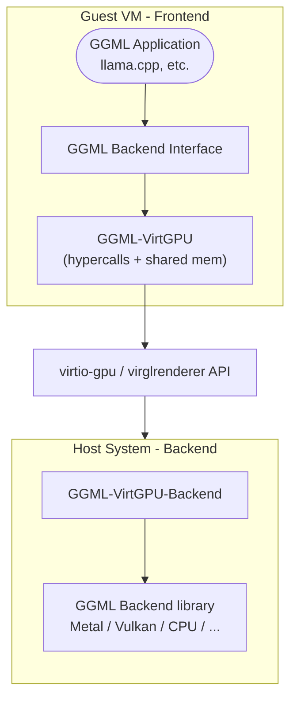

# GGML-VirtGPU Backend

The GGML-VirtGPU backend enables GGML applications to run machine
learning computations on host hardware while the application itself
runs inside a virtual machine.  It uses host-guest shared memory to
efficiently share data buffers between the two sides.

This backend relies on the virtio-gpu, and VirglRenderer API Remoting
(APIR) component. The backend is split into two libraries:
- a GGML implementation (the "remoting frontend"), running in the
  guest and interacting with the virtgpu device
- a VirglRenderer APIR compatible library (the "remoting backend"),
  running in the host and interacting with Virglrenderer and an actual
  GGML device backend.

## OS support

| OS       | Status            | Backend     | CI testing  | Notes
| -------- | ----------------- | ----------- | ----------- | -----
| MacOS 14 | Supported         | ggml-metal  | X           | Working when compiled on MacOS 14
| MacOS 15 | Supported         | ggml-metal  | X           | Working when compiled on MacOS 14 or MacOS 15
| MacOS 26 | Not tested        |             |             |
| Linux    | Under development | ggml-vulkan | not working | Working locally, CI running into deadlocks

## Architecture Overview

The GGML-VirtGPU backend consists of three main components:

### Key Components

1. **Guest-side Frontend** (`ggml-virtgpu/`): Implements the GGML backend interface and forwards operations to the host
2. **Host-side Backend** (`ggml-virtgpu/backend/`): Receives forwarded operations and executes them on actual hardware backends
3. **Communication Layer**: Uses virtio-gpu hypercalls and shared memory for efficient data transfer

## Features

- **Dynamic backend loading** on the host side (CPU, CUDA, Metal, etc.)
- **Zero-copy data transfer** via host-guest shared memory pages

## Communication Protocol

### Hypercalls and Shared Memory

The backend uses two primary communication mechanisms:

1. **Hypercalls (`DRM_IOCTL_VIRTGPU_EXECBUFFER`)**: Trigger remote execution from guest to host
2. **Shared Memory Pages**: Zero-copy data transfer for tensors and parameters

#### Shared Memory Layout

Each connection uses two shared memory buffers:

- **Data Buffer** (24 MiB): For command/response data and tensor transfers
- **Reply Buffer** (16 KiB): For command replies and status information
- **Data Buffers**: Dynamically allocated host-guest shared buffers
  served as GGML buffers.

### APIR Protocol

The Virglrender API Remoting protocol defines three command types:

- `HANDSHAKE`: Protocol version negotiation and capability discovery
- `LOADLIBRARY`: Dynamic loading of backend libraries on the host
- `FORWARD`: API function call forwarding

### Binary Serialization

Commands and data are serialized using a custom binary protocol with:

- Fixed-size encoding for basic types
- Variable-length arrays with size prefixes
- Buffer bounds checking
- Error recovery mechanisms

## Supported Operations

### Device Operations
- Device enumeration and capability queries
- Memory information (total/free)
- Backend type detection

### Buffer Operations
- Buffer allocation and deallocation
- Tensor data transfer (host ↔ guest)
- Memory copying and clearing

### Computation Operations
- Graph execution forwarding

## Build Requirements

### Guest-side Dependencies
- `libdrm` for DRM/virtio-gpu communication
- C++20 compatible compiler
- CMake 3.14+

### Host-side Dependencies
- virglrenderer with APIR support (pending upstream review)
- Target backend libraries (libggml-metal, libggml-vulkan, etc.)

## Configuration

### Environment Variables

- `GGML_VIRTGPU_BACKEND_LIBRARY`: Path to the host-side backend library
- `GGML_VIRTGPU_DEBUG`: Enable debug logging

### Build Options

- `GGML_VIRTGPU`: Enable the VirtGPU backend (`ON` or `OFF`, default: `OFF`)
- `GGML_VIRTGPU_BACKEND`: Build the host-side backend component (`ON`, `OFF` or `ONLY`, default: `OFF`)

### System Requirements

- VM with virtio-gpu support
- VirglRenderer with APIR patches
- Compatible backend libraries on host

## Limitations

- **VM-specific**: Only works in virtual machines with virtio-gpu support
- **Host dependency**: Requires properly configured host-side backend
- **Latency**: Small overhead from VM escaping for each operation

* This work is pending upstream changes in the VirglRenderer
  project.
  * The backend can be tested with Virglrenderer compiled from source
  using this PR:
  https://gitlab.freedesktop.org/virgl/virglrenderer/-/merge_requests/1590
* This work is pending changes in the VMM/hypervisor running the
  virtual machine, which need to know how to route the newly
  introduced APIR capset.
  * The environment variable `VIRGL_ROUTE_VENUS_TO_APIR=1` allows
    using the Venus capset, until the relevant hypervisors have been
    patched. However, setting this flag breaks the Vulkan/Venus normal
    behavior.
  * The environment variable `GGML_REMOTING_USE_APIR_CAPSET` tells the
    `ggml-virtgpu` backend to use the APIR capset. This will become
    the default when the relevant hypervisors have been patched.

* This work focused on improving the performance of llama.cpp running
  on MacOS containers, and is mainly tested on this platform. The
  linux support (via `krun`) is in progress.

## See Also

- [Development and Testing](VirtGPU/development.md)
- [Backend configuration](VirtGPU/configuration.md)
